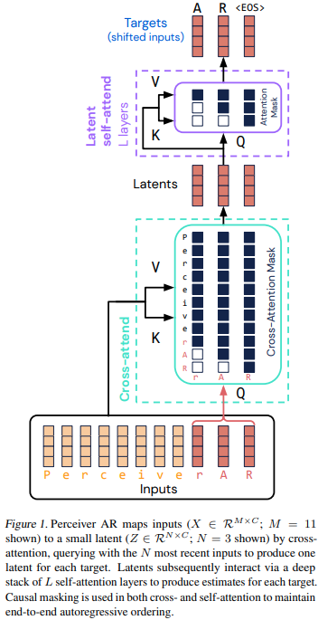

</img>

## Perceiver AR - Pytorch (wip)

Implementation of <a href="https://arxiv.org/abs/2202.07765">Perceiver AR</a>, Deepmind's new long-context attention network based on Perceiver architecture, in Pytorch.

<a href="https://storage.googleapis.com/perceiver-ar/index.html">Generated piano samples</a> - I guess we will have infinite <a href="https://en.wikipedia.org/wiki/Muzak">muzak</a> soon.

I am building this out of popular demand, not because I believe in the architecture. As someone else puts it succinctly, this is equivalent to an encoder / decoder transformer architecture where the encoder has 0 layers (and the decoder cross attention is restricted to 1 layer)

However, the experimental results they provided are still worthwhile and I'll build it out so students and researchers alike can explore along this avenue.

<a href="https://github.com/google-research/perceiver-ar">Official Jax repository</a>

## Install

```bash
$ pip install perceiver-ar-pytorch
```

## Usage

```python
import torch
from perceiver_ar_pytorch import PerceiverAR

model = PerceiverAR(
    num_tokens = 20000,             # number of tokens
    dim = 512,                      # model dimensions
    depth = 8,                      # model depth
    dim_head = 64,                  # attention head dimension
    heads = 8,                      # attention heads
    max_seq_len = 4096,             # total max sequence length
    cross_attn_seq_len = 3072,      # the sequence length in which to attend to, but does not undergo self attention (must be less than max_seq_len)
    cross_attn_dropout = 0.5,       # what percentage of the prefix to dropout during training, in paper they had extensive experimentation to show up to 50% dropout helped prevent overfitting
)

x = torch.randint(0, 20000, (1, 4096))

logits = model(x) # (1, 1024, 20000) - (4096 [seq len] - 3072 [perceived prefix] == 1024)
```

## Test

Enwik8 at 4096

```bash
$ python train.py
```

## Citations

```bibtex
@article{Hawthorne2022GeneralpurposeLA,
    title   = {General-purpose, long-context autoregressive modeling with Perceiver AR},
    author  = {Curtis Hawthorne and Andrew Jaegle and Cătălina Cangea and Sebastian Borgeaud and Charlie Nash and Mateusz Malinowski and Sander Dieleman and Oriol Vinyals and Matthew M. Botvinick and Ian Simon and Hannah R. Sheahan and Neil Zeghidour and Jean-Baptiste Alayrac and Jo{\~a}o Carreira and Jesse Engel},
    journal = {ArXiv},
    year    = {2022},
    volume  = {abs/2202.07765}
}
```
